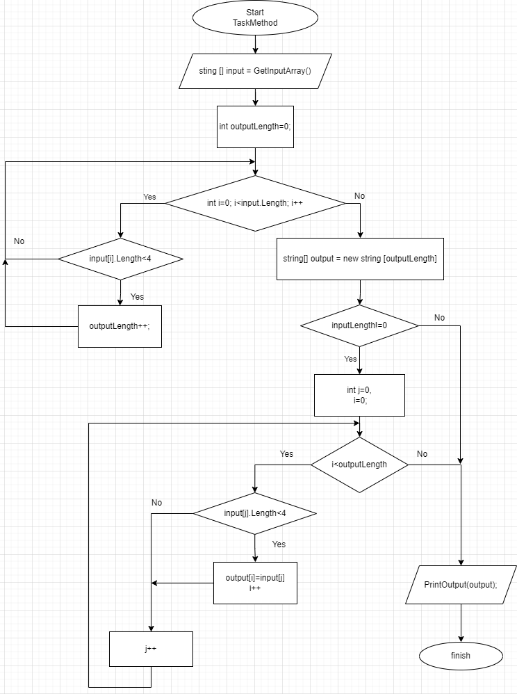

# Итоговая проверочная работа 
## Задача

## Блок-схема главного метода TaskMethod

## Текстовое описание решения

1. При помощи метода `GetInputArray` задаётся массив строк `input`
2. Объявляется целочисленная переменная `outputLength` равная 0, которая будет использоваться для подсчёта количества элементов массива `input`, состоящих из трёх и менее символов
3. Выполняется цикл с счётчиком при значении счётчика от 0 до длины массива input 
    * В цикле проверяется условие `input[i].Length<4`
    * В случае выполнения условия, значение переменной `outputLength` увеличивается на 1
4. Объявляется строковый массив `output` с длиной `outputLength`.
4. В случае, если переменная `outputLength` осталась равной нулю, программа переходит к пункту №7
5. В случае выполнения условия `outputLength!=0`, объявляется целочисленная переменная счётчика `j=0`, обнуляется переменная счётчика  `i`
6. Выполняется цикл с условием `i<outputLength`
    * В цикле проверяется условие `input[j].Length<4`
    * В случае выполнения условия, элементу массива `output[i]` присваивается значение элемента `input[j]`, а значение счётчика `i` увеличивается на 1
    * Значение счётчика `j` увеличивается на 1
7. При помощи метода `PrintOutput` массив `output` выводится в консоль